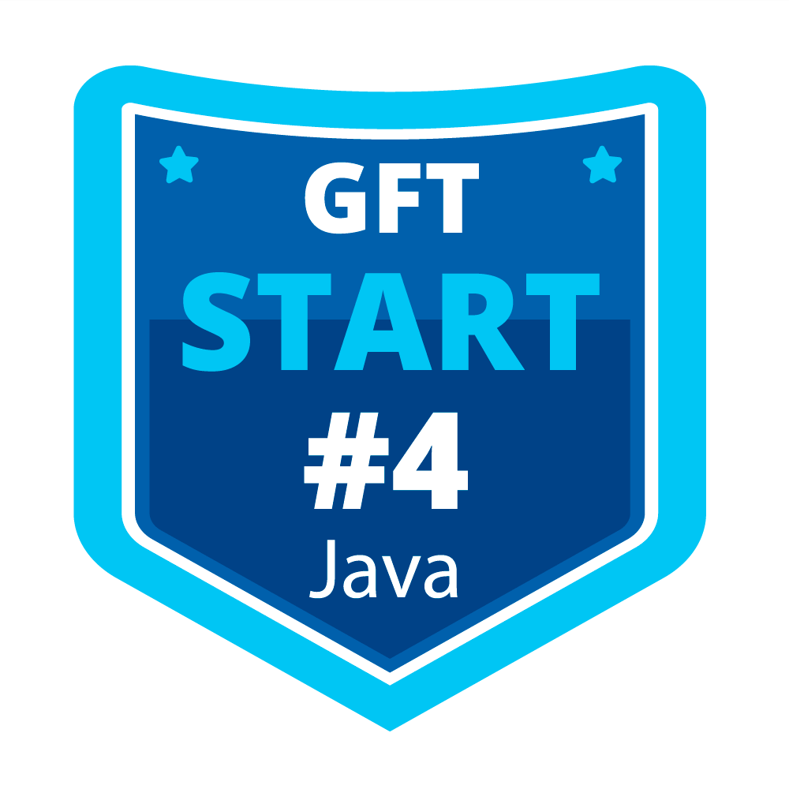

 

<!--Banner session-->

<!--Banner session-->

<h1 align="center">
Desafio de Projeto Abstraindo um Bootcamp Usando Orientação a Objetos em Java
<h4 align="center">
Portfólio criado com o intuito de mostrar meus projetos ao decorrer da minha carreira, incluir  as atividades da Digital Innovation One.

### Os bootcamps que estou estudando e buscando novos desafios na [Digital Innovation One](https://digitalinnovation.one/).

<!-- Ícones das linguagens -->

<!-- Java -->

<a href="[https://web.dio.me/track/java-developer]">

<!-- gft-start-4-Java -->

  
<!-- GFT - Quality Assurance#1 -->

  
<!-- Philips Fullstack Developer -->

  

